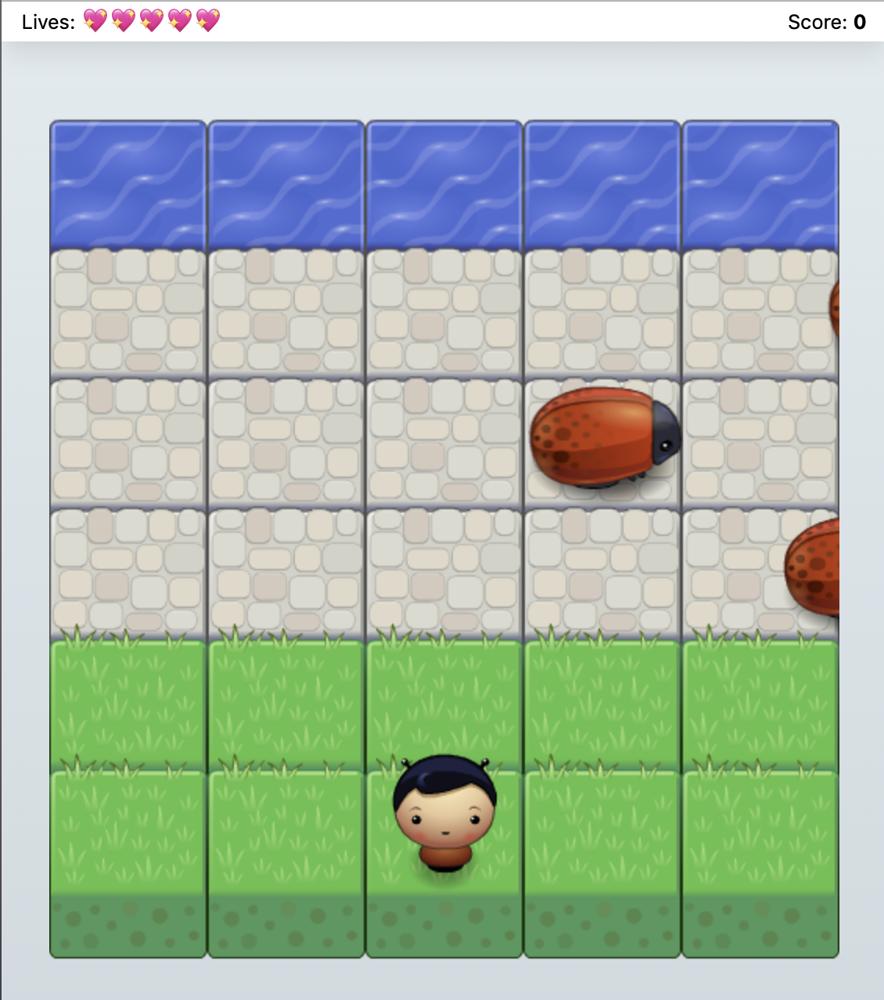

# Arcace Game
This arcade game was created as part of the Udacity Front-End Web Developer Nanodegree. It meets the requirements of the course. [Test it on Github Pages](https://philippherzig.github.io/udacity-arcade-game/)

## How To Play
You can control your own player with the arrow keys. The goal of the game is to reach the water without being caught by the enemy bug. When reaching the water, the player gets 50 score points and starts the next round. After each winning round the speed of the opponents increases. The player has lost the if he has no remaining lives. Try to get as high a score as possible.

## Install
Simply download or clone this repository and run index.html in a local browser or place it on a web server.

## Credits
* HTML and CSS is based on the [starter project provided by Udactiy](https://github.com/udacity/frontend-nanodegree-arcade-game)
